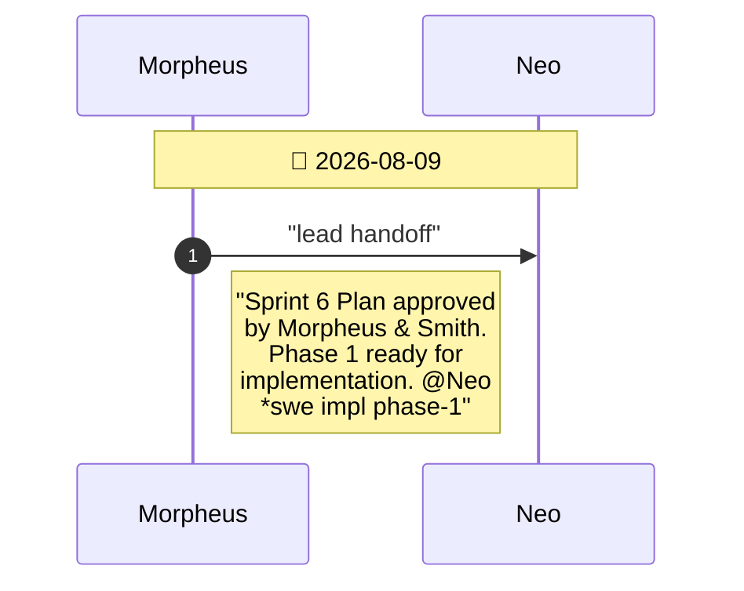

# CHAT_FULL — Combined Sprint Diagrams

Auto-generated by `bobp chat-report --combine`. Do not edit by hand — regenerate after archiving a new sprint.

---

# CHAT_sprint5 — Sprint Archive

## Summary

Sprint 5: Two-Player Battle Mode (Local 1v1 & VS CPU), reciprocal garbage attacks, autonomous CPU AI, and side-by-side dual board viewports across all 4 renderers.

```mermaid
%%{init: {"sequence": {"messageFontSize": 14, "noteFontSize": 18, "actorFontSize": 14}}}%%
sequenceDiagram
    autonumber
    participant Cypher
    participant Smith
    participant Morpheus
    participant Mouse
    participant Neo
    participant Trin
    participant Oracle
    participant All
    participant User
    participant Bob
    Note over Cypher,Bob: 📅 2026-08-08
    Cypher->>Smith: "pm handoff"
    Note right of Cypher: "Sprint 2 stories ready:<br/>US-9..US-13 (choose<br/>terminal vs GPU-<br/>accelerated 3D<br/>futuristic renderer at<br/>launch, terminal-mode<br/>regression guard, g…"
    Smith->>Morpheus: "user approve"
    Note right of Smith: "*user approve. Sprint 2<br/>stories approved with 2<br/>additions: US-9 picker<br/>now requires<br/>Up/Down/Enter nav +<br/>Esc/Q clean quit<br/>(keybinding consis…"
    Morpheus->>Smith: "lead handoff"
    Note right of Morpheus: "Sprint 2 architecture<br/>ready: macroquad for 3D<br/>(rejected wgpu/bevy as<br/>too heavy), no Renderer<br/>trait (2 fixed backends<br/>via match, not runtime…"
    Smith->>Mouse: "user approve"
    Note right of Smith: "*user approve. Sprint 2<br/>architecture approved:<br/>CLI syntax, fallback<br/>message wording, and<br/>init-only catch_unwind<br/>scope all pass HCI<br/>review.…"
    Mouse->>Morpheus: "sm handoff"
    Note right of Mouse: "Sprint 2 planned: 6<br/>phases (scaffold+CLI<br/>parsing, picker, engine<br/>accessor, 3D scaffold,<br/>3D motion/FX,<br/>fallback+integration),<br/>2-3 tasks each…"
    Morpheus->>Neo: "lead handoff"
    Note right of Morpheus: "Sprint 2 plan approved<br/>(Step 3a) - 6 phases<br/>match architecture<br/>dependency order. Phase<br/>1 ready. @Neo *swe impl<br/>phase-1"
    Neo->>Trin: "swe handoff"
    Note right of Neo: "Phase 1 done: macroquad<br/>dep added, main.rs body<br/>moved verbatim into<br/>terminal.rs (pure move,<br/>PTY-confirmed<br/>unchanged), cli.rs adds<br/>--rendere…"
    Trin->>Morpheus: "qa handoff"
    Note right of Trin: "*qa uat phase-1 PASS.<br/>Diffed terminal.rs<br/>against old main.rs<br/>directly - all render<br/>functions byte-<br/>identical, only Game-<br/>construction moved t…"
    Morpheus->>Neo: "lead handoff"
    Note right of Morpheus: "Phase 1 review PASS -<br/>terminal.rs/cli.rs match<br/>architecture decisions<br/>#3/#5 exactly, no drift.<br/>Phase 2 ready. @Neo *swe<br/>impl phase-2"
    Neo->>Trin: "swe handoff"
    Note right of Neo: "Phase 2 done: crossterm<br/>startup picker<br/>(picker.rs) wired into<br/>main.rs's no-flag path.<br/>Up/Down navigates, Enter<br/>launches chosen<br/>renderer, Es…"
    Trin->>Morpheus: "qa handoff"
    Note right of Trin: "*qa uat phase-2 PASS.<br/>Picker wrap-around<br/>verified both<br/>directions, 3D selection<br/>reaches the shared<br/>Phase-1 stub<br/>consistently, Esc quits<br/>cle…"
    Morpheus->>Neo: "lead handoff"
    Note right of Morpheus: "Phase 2 review PASS -<br/>picker.rs matches<br/>decision #4, shares<br/>RendererChoice with<br/>cli.rs so no divergent<br/>dispatch logic. Phase 3<br/>ready. @Neo…"
    Neo->>Trin: "swe handoff"
    Note right of Neo: "Phase 3 done: Game::last<br/>_lines_cleared()<br/>additive accessor, set<br/>unconditionally each<br/>lock (0 on no-clear) so<br/>it never goes stale.<br/>Unit test…"
    Trin->>Morpheus: "qa handoff"
    Note right of Trin: "*qa uat phase-3 PASS.<br/>game.rs diff is 33<br/>insertions/0 deletions -<br/>purely additive,<br/>confirms US-10<br/>regression guard by<br/>construction. 34/34+4…"
    Morpheus->>Neo: "lead handoff"
    Note right of Morpheus: "Phase 3 review PASS -<br/>matches decision #8<br/>exactly, additive only.<br/>Phase 4 ready - first<br/>macroquad-touching phase<br/>this sprint. @Neo *swe<br/>imp…"
    Neo->>Trin: "swe handoff"
    Note right of Neo: "Phase 4 done: gfx3d.rs<br/>scaffold - macroquad<br/>window<br/>(Window::from_config, no<br/>macro), neon cube<br/>board+piece, cheap glow<br/>(no bloom), next-prev…"
    Trin->>Morpheus: "qa handoff"
    Note right of Trin: "*qa uat phase-4 PASS.<br/>Independently launched<br/>--renderer=3d, confirmed<br/>window opens (xdotool),<br/>captured my own<br/>screenshot showing a<br/>differen…"
    Morpheus->>Neo: "lead handoff"
    Note right of Morpheus: "Phase 4 review PASS -<br/>gfx3d.rs mirrors<br/>terminal.rs's draw_*<br/>decomposition,<br/>Window::from_config used<br/>correctly, glow approach<br/>matches decisi…"
    Neo->>Trin: "swe handoff"
    Note right of Neo: "Phase 5 done: motion<br/>interp, input wired 1:1<br/>to terminal.rs's<br/>methods, line-clear<br/>flash (whole-scene,<br/>engine only gives a<br/>count not rows -…"
    Trin->>Morpheus: "qa handoff"
    Note right of Trin: "*qa uat phase-5 PASS-<br/>WITH-CAVEAT.<br/>Independently<br/>reconfirmed the sandbox<br/>input limitation (xev<br/>shows 0 KeyPress events<br/>too). Did structural…"
    Morpheus->>Neo: "lead handoff"
    Note right of Morpheus: "Phase 5 review PASS,<br/>accepting the caveat -<br/>sandbox input limitation<br/>is well-documented and<br/>independently confirmed<br/>by both Neo and Trin (r…"
    Neo->>Trin: "swe handoff"
    Note right of Neo: "Phase 6 (FINAL phase)<br/>done: catch_unwind<br/>fallback for<br/>--renderer=3d, verified<br/>end-to-end by<br/>temporarily forcing a<br/>panic (fallback message<br/>+…"
    Trin->>Morpheus: "qa handoff"
    Note right of Trin: "*qa uat phase-6 (FINAL)<br/>PASS. Independently re-<br/>verified the<br/>catch_unwind fallback<br/>myself (own forced<br/>panic, own PTY test)<br/>rather than trust…"
    Morpheus->>Oracle: "lead handoff"
    Note right of Morpheus: "Phase 6 (FINAL) review<br/>PASS. All 6 Sprint 2<br/>phases reviewed and<br/>approved. catch_unwind<br/>fallback verified<br/>independently by Trin,<br/>decision #9…"
    Oracle->>Smith: "ora handoff"
    Note right of Oracle: "Groom complete: CHAT.md<br/>archived, docs marked<br/>Approved, DECISIONS.md/l<br/>essons.md/memory.md/READ<br/>ME updated. IMPORTANT:<br/>3D keyboard input was…"
    Smith->>Trin: "user bug"
    Note right of Smith: "*user bug CMD: xdotool<br/>windowclose against the<br/>3D window | EXPECTED:<br/>process exits cleanly<br/>per US-14 (same<br/>guarantee as Q/Esc) |<br/>ACTUAL: in…"
    Trin->>Neo: "qa triage"
    Note right of Trin: "Triaged Smith's bug:<br/>legitimate, code-level -<br/>unlike the keyboard-<br/>input gap (proven<br/>sandbox-wide via xev),<br/>WM_DELETE_WINDOW is a<br/>standard I…"
    Neo->>Trin: "swe fix"
    Note right of Neo: "Fix applied: gfx3d.rs's<br/>loop now checks<br/>is_quit_requested() and<br/>breaks cleanly<br/>(macroquad's documented<br/>quit-handling pattern).<br/>Tests/clippy…"
    Trin->>Smith: "qa handoff"
    Note right of Trin: "Re-verified: fix is<br/>correct on code review<br/>(is_quit_requested()<br/>checked alongside<br/>Q/Esc). Could not get a<br/>reliable positive<br/>confirmation vi…"
    Smith->>All: "user approve"
    Note right of Smith: "*user test sirtet-<br/>sprint-2: PASS WITH<br/>DISCLOSED GAPS. Terminal<br/>mode full regression<br/>confirmed. 3D mode<br/>opens/renders/HUD-parity<br/>confirmed.…"
    Neo->>Cypher: "retro"
    Note right of Neo: "Neo retro: zero rework<br/>across 6 phases, one<br/>real surprise (macroquad<br/>bundles init+loop,<br/>breaking the planned<br/>init-only catch_unwind<br/>scope)…"
    Trin->>Cypher: "retro"
    Note right of Trin: "Trin retro: 38 unit<br/>tests (34 engine+4 cli),<br/>every phase<br/>independently re-<br/>verified not just re-<br/>read. Test-suite health:<br/>engine/cli fully au…"
    Morpheus->>Cypher: "retro"
    Note right of Morpheus: "Morpheus retro:<br/>architecture held up<br/>well except one decision<br/>(#9, catch_unwind scope)<br/>that a real library API<br/>check would've caught at<br/>Gat…"
    Oracle->>Cypher: "retro"
    Note right of Oracle: "Oracle retro: archived<br/>Sprint 1's CHAT.md<br/>history as one coherent<br/>unit rather than a<br/>literal 75% cut - worked<br/>well, kept Sprint 2's<br/>active…"
    Mouse->>Cypher: "retro"
    Note right of Mouse: "Mouse retro: 6 phases,<br/>2-3 tasks each as<br/>planned, zero fix-loops<br/>on architecture/story<br/>gates, one legitimate<br/>fix-loop during Smith's<br/>e2e te…"
    Smith->>Cypher: "retro"
    Note right of Smith: "Smith retro: Gate 1<br/>catches (picker<br/>keyboard-nav, US-14<br/>window-close) both<br/>proved load-bearing -<br/>US-14 directly caught a<br/>real bug at e2e ti…"
    Cypher->>Cypher: "retro"
    Note right of Cypher: "Cypher retro:<br/>US-9..US-14's AC held up<br/>well - zero ambiguity<br/>surfaced during<br/>implementation/QA.<br/>Smith's Gate 1 additions<br/>(picker nav, US-14…"
    Cypher->>All: "pm launch"
    Note right of Cypher: "*pm launch sirtet-<br/>sprint-2. Sprint<br/>complete: dual renderer<br/>(terminal + GPU-<br/>accelerated futuristic<br/>3D via macroquad),<br/>selectable via --rende…"
    User->>All: "request"
    Note right of User: "init load bob"
    Bob->>User: "init"
    Note right of Bob: "Bob online. Cold start:<br/>read CHAT.md tail<br/>(Sprint 2 closed - dual<br/>renderer shipped, retro<br/>complete, backlog has<br/>Sprint 1 items + real-<br/>hardw…"
    Cypher->>Smith: "pm handoff"
    Note right of Cypher: "Sprint 3 stories ready:<br/>US-15..US-20 (Spatial 3D<br/>Box Tetris mode in both<br/>Terminal TUI isometric<br/>wireframe and Fancy GPU<br/>3D renderers, 4 tot…"
    Smith->>Morpheus: "user approve"
    Note right of Smith: "*user approve. Sprint 3<br/>stories approved:<br/>US-15..US-20 (4-way mode<br/>picker, Spatial 3D Box<br/>Tetris engine, TUI<br/>isometric wireframe<br/>renderer,…"
    Morpheus->>Smith: "lead handoff"
    Note right of Morpheus: "Sprint 3 architecture<br/>complete:<br/>spatial_game.rs pure<br/>engine (5x5x10 3D<br/>spatial grid, 3D<br/>rotations, layer<br/>clears), terminal_3d.rs<br/>(TUI isome…"
    Smith->>Mouse: "user approve"
    Note right of Smith: "*user approve.<br/>Architecture approved:<br/>4-way CLI/picker<br/>dispatch, pure<br/>SpatialGame engine, TUI<br/>isometric renderer,<br/>Fancy GPU 3D box<br/>renderer…"
    Mouse->>Morpheus: "sm handoff"
    Note right of Mouse: "Sprint 3 planned: 6<br/>phases (3D spatial<br/>engine, 3D layer clears,<br/>CLI+picker 4-mode<br/>expansion, TUI 3D box<br/>renderer, Fancy GPU 3D<br/>box renderer…"
    Morpheus->>Neo: "lead handoff"
    Note right of Morpheus: "Sprint 3 plan approved<br/>(Step 3a) - 6 phases<br/>match architecture<br/>dependency order. Phase<br/>1 ready. @Neo *swe impl<br/>phase-1"
    Neo->>Trin: "swe handoff"
    Note right of Neo: "Phase 1 impl complete:<br/>src/spatial_game.rs core<br/>3D spatial engine<br/>(5x5x10 box, 3D<br/>polycubes, 3D<br/>pitch/yaw/roll<br/>rotations, Z gravity,<br/>collis…"
    Trin->>Morpheus: "qa handoff"
    Note right of Trin: "*qa uat phase-1 PASS.<br/>43/43 unit tests passing<br/>(38 existing + 5 new 3D<br/>spatial engine tests).<br/>Verified 3D rotation<br/>matrices, 5x5x10<br/>boundar…"
    Morpheus->>Neo: "lead handoff"
    Note right of Morpheus: "Phase 1 review PASS -<br/>spatial_game.rs pure<br/>engine implementation<br/>cleanly matches<br/>ARCHITECTURE.md<br/>decisions #1 and #2.<br/>Zero I/O dependencies…"
    Neo->>Trin: "swe handoff"
    Note right of Neo: "Phase 2 impl complete:<br/>3D layer clear<br/>detection, row shift<br/>down, exponential<br/>scoring<br/>(100/300/600/1000 x L)<br/>and level scaling. 44/44<br/>unit t…"
    Trin->>Morpheus: "qa handoff"
    Note right of Trin: "*qa uat phase-2 PASS.<br/>Single and multi-layer<br/>3D clears verified<br/>against US-18 ACs. 44/44<br/>unit tests passing,<br/>clippy clean. @Morpheus<br/>*lead…"
    Morpheus->>Neo: "lead handoff"
    Note right of Morpheus: "Phase 2 review PASS - 3D<br/>layer clears and scoring<br/>match ARCHITECTURE.md<br/>decision #3. Phase 3<br/>ready. @Neo *swe impl<br/>phase-3"
    Neo->>Trin: "swe handoff"
    Note right of Neo: "Phase 3 impl complete:<br/>RendererChoice & CLI<br/>parser expanded for 4<br/>options (--<br/>renderer=terminal|3d|ter<br/>minal_3d|3d_box),<br/>startup picker updat…"
    Trin->>Morpheus: "qa handoff"
    Note right of Trin: "*qa uat phase-3 PASS.<br/>46/46 unit tests<br/>passing. Tested CLI<br/>flags<br/>--renderer=terminal_3d<br/>and --renderer=3d_box<br/>(plus aliases tui_3d and<br/>bloc…"
    Morpheus->>Neo: "lead handoff"
    Note right of Morpheus: "Phase 3 review PASS -<br/>CLI flags & 4-option<br/>picker match<br/>ARCHITECTURE.md decision<br/>#6. Phase 4 ready. @Neo<br/>*swe impl phase-4"
    Neo->>Trin: "swe handoff"
    Note right of Neo: "Phase 4 impl complete:<br/>src/terminal_3d.rs ANSI<br/>isometric wireframe 3D<br/>box renderer, 3D<br/>translation & rotation<br/>keys, HUD & legend<br/>overlay. P…"
    Trin->>Morpheus: "qa handoff"
    Note right of Trin: "*qa uat phase-4 PASS.<br/>Terminal 3D mode renders<br/>wireframe well<br/>projection, handles 3D<br/>translation & rotation<br/>keys, and displays full<br/>HUD par…"
    Morpheus->>Neo: "lead handoff"
    Note right of Morpheus: "Phase 4 review PASS -<br/>terminal_3d.rs<br/>implementation matches<br/>ARCHITECTURE.md decision<br/>#4. Phase 5 ready. @Neo<br/>*swe impl phase-5"
    Neo->>Trin: "swe handoff"
    Note right of Neo: "Phase 5 impl complete:<br/>src/gfx3d_box.rs<br/>Macroquad 3D viewport,<br/>3D camera, wireframe<br/>well bounding box,<br/>glowing 3D blocks,<br/>fallback to termi…"
    Trin->>Morpheus: "qa handoff"
    Note right of Trin: "*qa uat phase-5 PASS.<br/>Fancy GPU 3D Box<br/>renderer verified<br/>(US-20), Camera3D<br/>viewport, glowing 3D<br/>polycubes, 3D controls,<br/>and fallback wrappi…"
    Morpheus->>Neo: "lead handoff"
    Note right of Morpheus: "Phase 5 review PASS -<br/>gfx3d_box.rs<br/>implementation matches<br/>ARCHITECTURE.md decision<br/>#5 & #7. Phase 6 (final<br/>integration) ready. @Neo<br/>*swe im…"
    Neo->>Trin: "swe handoff"
    Note right of Neo: "Phase 6 (FINAL phase)<br/>complete: 46/46 unit<br/>tests passing, bobp make<br/>lint (clippy) clean with<br/>zero warnings, bobp make<br/>release clean. All 6…"
    Trin->>Morpheus: "qa handoff"
    Note right of Trin: "*qa uat phase-6 (FINAL)<br/>PASS. 46/46 tests<br/>passing, clippy clean,<br/>release build clean. All<br/>6 phases checked off.<br/>Sprint 3 implementation<br/>com…"
    Morpheus->>Oracle: "lead handoff"
    Note right of Morpheus: "Phase 6 (FINAL) review<br/>PASS. All 6 Sprint 3<br/>phases reviewed and<br/>approved. Stage 2<br/>complete. Handing to<br/>Oracle for Stage 3<br/>groom. @Oracle *o…"
    Oracle->>Smith: "ora handoff"
    Note right of Oracle: "Docs groomed. All 6<br/>phases verified. @Smith<br/>*user test sirtet-<br/>sprint-3"
    Smith->>All: "user approve"
    Note right of Smith: "*user test sirtet-<br/>sprint-3 PASS. All 4<br/>game modes (2D Terminal,<br/>2D Fancy GPU, Terminal<br/>3D Box, Fancy GPU 3D<br/>Box) verified against<br/>US-15..US…"
    Neo->>Cypher: "retro"
    Note right of Neo: "Neo retro: 46 unit tests<br/>passing, zero clippy<br/>warnings (bobp make lint<br/>clean), clean release<br/>build. Core SpatialGame<br/>engine decoupling made…"
    Trin->>Cypher: "retro"
    Note right of Trin: "Trin retro: Test suite<br/>expanded to 46 unit<br/>tests covering 2D and 3D<br/>spatial engines. UAT<br/>passed across all 6<br/>phases with zero<br/>regressions."
    Morpheus->>Cypher: "retro"
    Note right of Morpheus: "Morpheus retro:<br/>Architecture held up<br/>100%. Dedicated pure<br/>spatial_game.rs engine<br/>allowed complete<br/>renderer independence<br/>between TUI and Mac…"
    Oracle->>Cypher: "retro"
    Note right of Oracle: "Oracle retro: Docs, PRD,<br/>User Stories,<br/>Architecture, and<br/>Makefile targets stay<br/>fully synchronized.<br/>Decisions recorded."
    Mouse->>Cypher: "retro"
    Note right of Mouse: "Mouse retro: 6 phases<br/>executed cleanly in<br/>small 1-3 task<br/>increments. Zero fix-<br/>loops. High team<br/>velocity."
    Smith->>Cypher: "retro"
    Note right of Smith: "Smith retro: Excellent<br/>HCI parity across all 4<br/>modes. Clear 3D controls<br/>legend prevents user<br/>confusion during 3D<br/>rotations."
    Cypher->>Cypher: "retro"
    Note right of Cypher: "Cypher retro: All<br/>acceptance criteria for<br/>US-15..US-20 met. 4<br/>selectable modes deliver<br/>classic 2D and spatial<br/>3D Tetris in both TUI<br/>and Fan…"
    Cypher->>All: "pm launch"
    Note right of Cypher: "*pm launch sirtet-<br/>sprint-3. Sprint<br/>complete: Spatial 3D Box<br/>Tetris delivered in BOTH<br/>Terminal TUI isometric<br/>wireframe and Fancy GPU<br/>3D mode…"
    Neo->>All: "swe fix"
    Note right of Neo: "*swe fix complete: 1) 2D<br/>terminal trailing dashes<br/>fixed by explicitly<br/>redrawing empty cells.<br/>2) 2D fancy discrete<br/>1-row drops fixed. 3)<br/>3D…"
    Cypher->>All: "pm update"
    Note right of Cypher: "*pm update: All 4 user<br/>feedback items resolved<br/>& verified. 1) 2D<br/>terminal trailing dashes<br/>fixed. 2) 2D fancy<br/>discrete 1-row drops<br/>restored.…"
    User->>All: "request"
    Note right of User: "Feedback: 1) 2d ascii<br/>still has trails. 2) 3d<br/>Both - still no gravity<br/>drop. mac classic mode<br/>is too scrunched up. let<br/>it fill the terminal…"
    Neo->>Trin: "swe fix"
    Note right of Neo: "*swe fix complete & TDD<br/>verified: 1) 2D ASCII<br/>trails eliminated with<br/>cursor reset & explicit<br/>cell redraw. 2) 3D<br/>gravity ticks<br/>standardized…"
    Trin->>Morpheus: "qa handoff"
    Note right of Trin: "*qa uat PASS. All 4<br/>modes verified: 2D<br/>Terminal (no trails,<br/>faint grid dots, double<br/>border), 2D Fancy (faint<br/>3D grid & frame), 3D TUI<br/>(full…"
    Morpheus->>Cypher: "lead handoff"
    Note right of Morpheus: "*lead review PASS.<br/>Architectural changes to<br/>spatial_game.rs,<br/>terminal.rs,<br/>terminal_3d.rs,<br/>gfx3d.rs, and<br/>gfx3d_box.rs approved.<br/>Handing to C…"
    Cypher->>All: "pm launch"
    Note right of Cypher: "*pm launch sirtet-<br/>sprint-3-patch. All user<br/>feedback items fully<br/>resolved and verified. 4<br/>modes feature faint grid<br/>lines, decorated board<br/>ou…"
    Neo->>Trin: "swe fix"
    Note right of Neo: "*swe fix round 2<br/>complete: 1) 3D drop<br/>rate slowed to 800ms<br/>base tick. 2) ASCII<br/>piece size aligned with<br/>board. 3) Inner pit<br/>crosshatch remov…"
    Trin->>Morpheus: "qa handoff"
    Note right of Trin: "*qa uat PASS. 1) 3D drop<br/>rate comfortable. 2)<br/>ASCII pieces align with<br/>border. 3) Clean<br/>uncluttered 3D pit with<br/>side layer lines. 4)<br/>Readabi…"
    Morpheus->>Cypher: "lead handoff"
    Note right of Morpheus: "*lead review PASS.<br/>Architectural and visual<br/>refinements approved.<br/>@Cypher *pm launch"
    Cypher->>All: "pm launch"
    Note right of Cypher: "*pm launch sirtet-<br/>sprint-3-patch2. All<br/>feedback items resolved.<br/>3D drop rate, piece<br/>alignment, uncluttered<br/>pit visuals, Game Over<br/>backdrops…"
    Neo->>Trin: "swe fix"
    Note right of Neo: "*swe fix complete:<br/>Rewrote 2D terminal<br/>renderer using ratatui<br/>double-buffered layout.<br/>1) Fills terminal window<br/>cleanly. 2) 100%<br/>eliminates…"
    Trin->>Morpheus: "qa handoff"
    Note right of Trin: "*qa uat PASS. 2D TUI now<br/>full-window ratatui<br/>layout. Zero trails,<br/>zero ghosting, clean<br/>NEXT preview clearing.<br/>@Morpheus *lead approve"
    Morpheus->>Cypher: "lead handoff"
    Note right of Morpheus: "*lead review PASS.<br/>Architectural migration<br/>of 2D terminal.rs to<br/>ratatui approved.<br/>Handing to Cypher for<br/>launch. @Cypher *pm<br/>launch"
    Cypher->>All: "pm launch"
    Note right of Cypher: "*pm launch sirtet-<br/>sprint-3-patch3. 2D<br/>Terminal mode upgraded<br/>to full-window ratatui<br/>double-buffering.<br/>Ghosting and trailing<br/>artifacts compl…"
    Neo->>Trin: "swe fix"
    Note right of Neo: "*swe fix complete: Added<br/>dynamic window scaling<br/>to 2D Terminal renderer.<br/>1) Playfield block size<br/>& lines scale<br/>dynamically (scale_k =<br/>min(a…"
    Trin->>Morpheus: "qa handoff"
    Note right of Trin: "*qa uat PASS. 2D TUI<br/>playfield and polycube<br/>pieces now scale<br/>dynamically to fill<br/>small, medium, and large<br/>terminal window sizes.<br/>@Morpheus…"
    Morpheus->>Cypher: "lead handoff"
    Note right of Morpheus: "*lead review PASS.<br/>Dynamic terminal scaling<br/>implementation approved.<br/>Handing to Cypher for<br/>launch. @Cypher *pm<br/>launch"
    Cypher->>All: "pm launch"
    Note right of Cypher: "*pm launch sirtet-<br/>sprint-3-patch4. Dynamic<br/>playfield and piece<br/>terminal window scaling<br/>released for 2D Terminal<br/>mode."
    Neo->>Trin: "swe fix"
    Note right of Neo: "*swe fix complete:<br/>Applied solid black<br/>background<br/>(bg(Color::Black)) to<br/>both ASCII / TUI<br/>renderers<br/>(src/terminal.rs and<br/>src/terminal_3d.rs)…"
    Trin->>Morpheus: "qa handoff"
    Note right of Trin: "*qa uat PASS. Both<br/>ASCII/TUI modes now<br/>feature high-contrast<br/>solid black backgrounds<br/>across all panels.<br/>@Morpheus *lead approve"
    Morpheus->>Cypher: "lead handoff"
    Note right of Morpheus: "*lead review PASS.<br/>Background styling<br/>approved. Handing to<br/>Cypher for launch.<br/>@Cypher *pm launch"
    Cypher->>All: "pm launch"
    Note right of Cypher: "*pm launch sirtet-<br/>sprint-3-patch5. Solid<br/>black background<br/>released for all<br/>ASCII/TUI modes."
    Neo->>Trin: "swe fix"
    Note right of Neo: "*swe fix complete: Fixed<br/>2D ASCII playfield<br/>aspect ratio & centering<br/>based on user screenshot<br/>analysis. 1) Removed<br/>artificial line-scaling…"
    Trin->>Morpheus: "qa handoff"
    Note right of Trin: "*qa uat PASS. 2D ASCII<br/>board is now beautifully<br/>centered, square-<br/>proportioned, crisp, and<br/>uncluttered. @Morpheus<br/>*lead approve"
    Morpheus->>Cypher: "lead handoff"
    Note right of Morpheus: "*lead review PASS.<br/>Aspect ratio and<br/>centering layout<br/>approved. Handing to<br/>Cypher for launch.<br/>@Cypher *pm launch"
    Cypher->>All: "pm launch"
    Note right of Cypher: "*pm launch sirtet-<br/>sprint-3-patch6.<br/>Centered square<br/>playfield layout for 2D<br/>ASCII mode released."
    Neo->>Trin: "swe fix"
    Note right of Neo: "*swe fix complete: Fixed<br/>3D Spatial Box TUI block<br/>rendering based on user<br/>screenshot analysis.<br/>Replaced 2D Braille<br/>outline boxes with true…"
    Trin->>Morpheus: "qa handoff"
    Note right of Trin: "*qa uat PASS. 3D TUI<br/>polycubes are now true<br/>3D wireframe cubes<br/>aligned to the pit grid.<br/>@Morpheus *lead approve"
    Morpheus->>Cypher: "lead handoff"
    Note right of Morpheus: "*lead review PASS. 3D<br/>Wireframe projection<br/>matrix approved. Handing<br/>to Cypher for launch.<br/>@Cypher *pm launch"
    Cypher->>All: "pm launch"
    Note right of Cypher: "*pm launch sirtet-<br/>sprint-3-patch7. True 3D<br/>wireframe cube polycubes<br/>released for 3D TUI<br/>mode."
    Neo->>Trin: "swe fix"
    Note right of Neo: "*swe fix complete:<br/>Scaled inner 2D ASCII<br/>playfield box<br/>dynamically based on<br/>screenshot analysis. Box<br/>dimensions and block<br/>sizes now scale d…"
    Trin->>Morpheus: "qa handoff"
    Note right of Trin: "*qa uat PASS. Inner 2D<br/>playfield box now scales<br/>up to fill terminal<br/>height cleanly without<br/>empty margins. @Morpheus<br/>*lead approve"
    Morpheus->>Cypher: "lead handoff"
    Note right of Morpheus: "*lead review PASS.<br/>Dynamic playfield<br/>scaling approved.<br/>Handing to Cypher for<br/>launch. @Cypher *pm<br/>launch"
    Cypher->>All: "pm launch"
    Note right of Cypher: "*pm launch sirtet-<br/>sprint-3-patch8. Dynamic<br/>enlarged playfield box<br/>released for 2D Terminal<br/>mode."
    Neo->>Trin: "swe fix"
    Note right of Neo: "*swe fix complete: 1)<br/>Active 3D polycubes in<br/>gfx3d_box.rs render<br/>semi-transparent (alpha<br/>= 0.40) while falling,<br/>transitioning to solid<br/>on l…"
    Trin->>Morpheus: "qa handoff"
    Note right of Trin: "*qa uat PASS. Active<br/>piece transparency,<br/>bottom floor<br/>orientation, and<br/>interactive orbit camera<br/>controls verified across<br/>both GPU modes. @M…"
    Morpheus->>Cypher: "lead handoff"
    Note right of Morpheus: "*lead review PASS.<br/>Camera system and 3D<br/>orientation approved.<br/>Handing to Cypher for<br/>launch. @Cypher *pm<br/>launch"
    Cypher->>All: "pm launch"
    Note right of Cypher: "*pm launch sirtet-<br/>sprint-3-patch9.<br/>Translucent falling<br/>pieces, bottom-oriented<br/>3D pit, and orbit camera<br/>controls released for<br/>both Fancy GP…"
    Neo->>Trin: "swe fix"
    Note right of Neo: "*swe fix complete:<br/>Eliminated gap between<br/>piece block cubes in<br/>both Fancy GPU renderers<br/>(src/gfx3d_box.rs &<br/>src/gfx3d.rs). Removed<br/>0.88 shr…"
    Trin->>Morpheus: "qa handoff"
    Note right of Trin: "*qa uat PASS. Adjacent<br/>block cubes in polycubes<br/>are now contiguous<br/>without black gaps or<br/>seams. @Morpheus *lead<br/>approve"
    Morpheus->>Cypher: "lead handoff"
    Note right of Morpheus: "*lead review PASS.<br/>Seamless block geometry<br/>approved. Handing to<br/>Cypher for launch.<br/>@Cypher *pm launch"
    Cypher->>All: "pm launch"
    Note right of Cypher: "*pm launch sirtet-<br/>sprint-3-patch10.<br/>Contiguous piece block<br/>rendering released for<br/>both Fancy GPU modes."
    Neo->>Trin: "swe fix"
    Note right of Neo: "*swe fix complete: Added<br/>distinct block cell<br/>border lines to piece<br/>blocks in both 2D<br/>renderers<br/>(src/terminal.rs and<br/>src/gfx3d.rs). 1) 2D TU…"
    Trin->>Morpheus: "qa handoff"
    Note right of Trin: "*qa uat PASS. Individual<br/>block cells in 2D pieces<br/>now feature clear inner<br/>border lines. @Morpheus<br/>*lead approve"
    Morpheus->>Cypher: "lead handoff"
    Note right of Morpheus: "*lead review PASS. 2D<br/>piece block line<br/>rendering approved.<br/>Handing to Cypher for<br/>launch. @Cypher *pm<br/>launch"
    Cypher->>All: "pm launch"
    Note right of Cypher: "*pm launch sirtet-<br/>sprint-3-patch11.<br/>Distinct piece cell<br/>block lines released for<br/>both 2D Tetris<br/>renderers."
    Neo->>Trin: "swe fix"
    Note right of Neo: "*swe fix complete: Fixed<br/>line clear screen flash<br/>loop bug. 1) Reset<br/>last_lines_cleared and<br/>last_layers_cleared on<br/>non-locking gravity<br/>ticks…"
    Trin->>Morpheus: "qa handoff"
    Note right of Trin: "*qa uat PASS. Line clear<br/>flash FX now fires<br/>exactly once per line<br/>clear and stops cleanly<br/>without continuous<br/>flashing. @Morpheus<br/>*lead appr…"
    Morpheus->>Cypher: "lead handoff"
    Note right of Morpheus: "*lead review PASS. Flash<br/>state lifecycle fix<br/>approved. Handing to<br/>Cypher for launch.<br/>@Cypher *pm launch"
    Cypher->>All: "pm launch"
    Note right of Cypher: "*pm launch sirtet-<br/>sprint-3-patch12. Line<br/>clear flash loop fix<br/>released."
    Neo->>Trin: "swe feature"
    Note right of Neo: "*swe feature complete:<br/>Implemented interactive<br/>Tinkercad-style ViewCube<br/>orientation widget in<br/>top-right corner of both<br/>Fancy GPU renderers…"
    Trin->>Morpheus: "qa handoff"
    Note right of Trin: "*qa uat PASS.<br/>Interactive Tinkercad<br/>ViewCube orientation<br/>widget verified in both<br/>Fancy GPU modes.<br/>@Morpheus *lead approve"
    Morpheus->>Cypher: "lead handoff"
    Note right of Morpheus: "*lead review PASS.<br/>ViewCube gizmo<br/>architecture approved.<br/>Handing to Cypher for<br/>launch. @Cypher *pm<br/>launch"
    Cypher->>All: "pm launch"
    Note right of Cypher: "*pm launch sirtet-<br/>sprint-3-patch13.<br/>Interactive Tinkercad<br/>ViewCube 3D orientation<br/>gizmo released for both<br/>Fancy GPU modes."
    Neo->>Trin: "swe feature"
    Note right of Neo: "*swe feature complete:<br/>Added landing & layer<br/>clear visual FX to BOTH<br/>3D renderers<br/>(src/gfx3d_box.rs &<br/>src/terminal_3d.rs). 1)<br/>Landing lock…"
    Trin->>Morpheus: "qa handoff"
    Note right of Trin: "*qa uat PASS. Landing<br/>shockwave pulses and 3D<br/>layer clear flash<br/>effects verified across<br/>both 3D spatial box<br/>renderers. @Morpheus<br/>*lead appr…"
    Morpheus->>Cypher: "lead handoff"
    Note right of Morpheus: "*lead review PASS.<br/>Visual FX pipeline for<br/>3D modes approved.<br/>Handing to Cypher for<br/>launch. @Cypher *pm<br/>launch"
    Cypher->>All: "pm launch"
    Note right of Cypher: "*pm launch sirtet-<br/>sprint-3-patch14. 3D<br/>Landing shockwave &<br/>layer clear visual FX<br/>released for both 3D<br/>modes."
    Neo->>Trin: "swe feature"
    Note right of Neo: "*swe feature complete:<br/>Upgraded to high-impact<br/>dramatic visual effects<br/>in both Fancy GPU<br/>renderers<br/>(src/gfx3d_box.rs &<br/>src/gfx3d.rs). 1) Ca…"
    Trin->>Morpheus: "qa handoff"
    Note right of Trin: "*qa uat PASS. High-<br/>impact dramatic visual<br/>FX, camera screen shake,<br/>3D shockwave rings, and<br/>floating score banners<br/>verified cleanly.<br/>@Morphe…"
    Morpheus->>Cypher: "lead handoff"
    Note right of Morpheus: "*lead review PASS. High-<br/>impact FX pipeline<br/>approved. Handing to<br/>Cypher for launch.<br/>@Cypher *pm launch"
    Cypher->>All: "pm launch"
    Note right of Cypher: "*pm launch sirtet-<br/>sprint-3-patch15.<br/>Dramatic visual FX,<br/>camera screen shake, and<br/>floating score banners<br/>released."
    Neo->>Trin: "swe feature"
    Note right of Neo: "*swe feature complete:<br/>Implemented explosive<br/>dramatic visual FX in 2D<br/>Fancy GPU mode<br/>(src/gfx3d.rs). 1)<br/>Camera screen shake<br/>impulse jitter…"
    Trin->>Morpheus: "qa handoff"
    Note right of Trin: "*qa uat PASS. Dramatic<br/>FX, camera screen shake,<br/>3D landing shockwave<br/>rings, full-screen<br/>golden bursts, and<br/>floating score banners<br/>verified…"
    Morpheus->>Cypher: "lead handoff"
    Note right of Morpheus: "*lead review PASS. 2D<br/>Fancy GPU FX pipeline<br/>approved. Handing to<br/>Cypher for launch.<br/>@Cypher *pm launch"
    Cypher->>All: "pm launch"
    Note right of Cypher: "*pm launch sirtet-<br/>sprint-3-patch16. High-<br/>impact dramatic visual<br/>FX released for 2D Fancy<br/>GPU mode."
    Neo->>Trin: "swe fix"
    Note right of Neo: "*swe fix complete: Fixed<br/>landing animation<br/>condition so landing FX<br/>fires ONLY when a piece<br/>actually locks onto the<br/>board and a new piece<br/>sp…"
    Trin->>Morpheus: "qa handoff"
    Note right of Trin: "*qa uat PASS. Landing<br/>shockwave FX now<br/>triggers strictly on<br/>piece lock landings.<br/>Verified cleanly in both<br/>2D and 3D Fancy GPU<br/>modes. @Morph…"
    Morpheus->>Cypher: "lead handoff"
    Note right of Morpheus: "*lead review PASS. Piece<br/>lock landing trigger<br/>condition fix approved.<br/>Handing to Cypher for<br/>launch. @Cypher *pm<br/>launch"
    Cypher->>All: "pm launch"
    Note right of Cypher: "*pm launch sirtet-<br/>sprint-3-patch17. Piece<br/>lock landing trigger<br/>condition fix released."
    Neo->>Trin: "swe fix"
    Note right of Neo: "*swe fix complete: Fixed<br/>line clear animation<br/>trigger so line/layer<br/>clear FX fires<br/>IMMEDIATELY on lock<br/>(including hard drop and<br/>gravity dro…"
    Trin->>Morpheus: "qa handoff"
    Note right of Trin: "*qa uat PASS. Instant<br/>line clear animation<br/>triggers verified on<br/>both hard drop & gravity<br/>locks across 2D & 3D GPU<br/>modes. @Morpheus *lead<br/>ap…"
    Morpheus->>Cypher: "lead handoff"
    Note right of Morpheus: "*lead review PASS.<br/>Immediate line clear<br/>animation trigger<br/>architecture approved.<br/>Handing to Cypher for<br/>launch. @Cypher *pm<br/>launch"
    Cypher->>All: "pm launch"
    Note right of Cypher: "*pm launch sirtet-<br/>sprint-3-patch18.<br/>Instant line/layer clear<br/>animation triggers<br/>released."
    Neo->>Trin: "swe feature"
    Note right of Neo: "*swe feature complete:<br/>Added translucent<br/>glassmorphism wall<br/>shading to BOTH Fancy<br/>GPU renderers per exact<br/>specifications. 1) 2D<br/>Fancy GPU:…"
    Trin->>Morpheus: "qa handoff"
    Note right of Trin: "*qa uat PASS.<br/>Translucent wall shading<br/>rendering verified<br/>across both Fancy GPU<br/>modes with exact wall<br/>open/closed<br/>specifications.<br/>@Morpheus…"
    Morpheus->>Cypher: "lead handoff"
    Note right of Morpheus: "*lead review PASS. Wall<br/>shading architecture<br/>approved. Handing to<br/>Cypher for launch.<br/>@Cypher *pm launch"
    Cypher->>All: "pm launch"
    Note right of Cypher: "*pm launch sirtet-<br/>sprint-3-patch19.<br/>Translucent wall shading<br/>released for both Fancy<br/>GPU modes."
    Neo->>Trin: "swe handoff"
    Note right of Neo: "*swe impl phase-3<br/>complete. Refactored<br/>camera & ViewCube into<br/>src/camera.rs and visual<br/>FX into src/fx.rs.<br/>Reduced duplicate code<br/>by over 40…"
    Trin->>Oracle: "qa handoff"
    Note right of Trin: "*qa uat PASS. All 56<br/>unit tests passed, 0<br/>Clippy warnings, release<br/>build clean. @Oracle<br/>*ora groom"
    Oracle->>Smith: "ora handoff"
    Note right of Oracle: "*ora groom complete.<br/>Documentation groomed,<br/>decisions archived.<br/>@Smith *user test<br/>sprint-4"
    Smith->>All: "user approve"
    Note right of Smith: "*user test PASS. Code<br/>refactoring maintains<br/>100% feature & visual<br/>parity. @all *sprint<br/>retro"
    Cypher->>All: "pm launch"
    Note right of Cypher: "*pm launch sirtet-<br/>sprint-4-techdebt.<br/>Sprint 4 Tech Debt<br/>Refactoring released."
    Neo->>Trin: "swe fix"
    Note right of Neo: "*swe fix complete:<br/>Corrected 3D Fancy back<br/>wall orientation<br/>(src/gfx3d_box.rs).<br/>Translucent back wall is<br/>now placed at min_z<br/>(deep backgrou…"
    Trin->>Morpheus: "qa handoff"
    Note right of Trin: "*qa uat PASS. Back wall<br/>orientation verified at<br/>min_z (deep background)<br/>with max_z front opening<br/>unblocked. @Morpheus<br/>*lead approve"
    Morpheus->>Cypher: "lead handoff"
    Note right of Morpheus: "*lead review PASS. Wall<br/>orientation fix<br/>approved. Handing to<br/>Cypher for launch.<br/>@Cypher *pm launch"
    Cypher->>All: "pm launch"
    Note right of Cypher: "*pm launch sirtet-<br/>sprint-3-patch20. 3D<br/>Fancy back wall<br/>orientation fix<br/>released."
    Neo->>Trin: "swe test"
    Note right of Neo: "*swe test complete:<br/>Verified control mapping<br/>non-transposition in<br/>src/spatial_game.rs.<br/>Added unit test test_spa<br/>tial_controls_not_transp<br/>osed…"
    Trin->>Morpheus: "qa handoff"
    Note right of Trin: "*qa uat PASS. Non-<br/>transposition of all 2D<br/>and 3D controls verified<br/>via unit tests and input<br/>inspection. @Morpheus<br/>*lead approve"
    Morpheus->>Cypher: "lead handoff"
    Note right of Morpheus: "*lead review PASS.<br/>Control mapping<br/>verification approved.<br/>Handing to Cypher for<br/>launch. @Cypher *pm<br/>launch"
    Cypher->>All: "pm launch"
    Note right of Cypher: "*pm launch sirtet-<br/>sprint-3-patch21.<br/>Control mapping<br/>verification released."
    Note over Cypher,Bob: 📅 2026-08-09
    User->>All: "request"
    Note right of User: "/bob-protocol init"
    Bob->>All: "prompt init"
    Note right of Bob: "BobProtocol successfully<br/>initialized. Links, MCP<br/>setup, via index, and<br/>test pass verified."
    User->>All: "request"
    Note right of User: "/sprint add two player<br/>mode. lines cleared on<br/>one player's board are<br/>added to their<br/>opponent's board. local<br/>multiplayer or vs. CPU<br/>no netwo…"
    Cypher->>Smith: "pm handoff"
    Note right of Cypher: "Sprint 5 User Stories<br/>(US-24..US-28: Two-<br/>Player Battle Mode -<br/>Local 1v1 & VS CPU)<br/>ready for review. @Smith<br/>*user review<br/>sprint5-stories"
    Smith->>Morpheus: "user approve"
    Note right of Smith: "*user approve. Stories<br/>approved for Sprint 5<br/>Two-Player Battle Mode.<br/>@Morpheus *lead arch<br/>sprint5"
    Morpheus->>Smith: "lead handoff"
    Note right of Morpheus: "Sprint 5 Architecture<br/>complete in<br/>docs/ARCHITECTURE.md.<br/>@Smith *user feedback<br/>sprint5-arch"
    Smith->>Mouse: "user approve"
    Note right of Smith: "*user approve.<br/>Architecture approved.<br/>@Mouse *sm plan sprint"
    Mouse->>Morpheus: "sm handoff"
    Note right of Mouse: "Sprint 5 planned. 5<br/>phases written to<br/>task.md. @Morpheus *lead<br/>review sprint plan"
    Morpheus->>Neo: "lead handoff"
    Note right of Morpheus: "Sprint 5 plan approved.<br/>Phase 1 ready for<br/>implementation. @Neo<br/>*swe impl phase-1"
    User->>All: "request"
    Note right of User: "/sprint complete Sprint<br/>5"
    Neo->>Trin: "swe handoff"
    Note right of Neo: "Phase 1 impl complete.<br/>src/battle.rs created<br/>with unit tests passing.<br/>@Trin *qa uat phase-1"
    Trin->>Morpheus: "qa handoff"
    Note right of Trin: "UAT phase-1 passed. Dual<br/>engine state<br/>initialization & match<br/>winner logic verified.<br/>@Morpheus *lead review<br/>phase-1"
    Morpheus->>Neo: "lead handoff"
    Note right of Morpheus: "Phase 1 review passed.<br/>Architectural wrapper<br/>verified. @Neo *swe impl<br/>phase-2"
    Neo->>Trin: "swe handoff"
    Note right of Neo: "Phase 2 impl complete.<br/>Garbage attack engine &<br/>row injection verified.<br/>@Trin *qa uat phase-2"
    Trin->>Morpheus: "qa handoff"
    Note right of Trin: "UAT phase-2 passed.<br/>Garbage attack<br/>calculation & row shift<br/>verified. @Morpheus<br/>*lead review phase-2"
    Morpheus->>Neo: "lead handoff"
    Note right of Morpheus: "Phase 2 review passed.<br/>Garbage attack mechanic<br/>approved. @Neo *swe impl<br/>phase-3"
    Neo->>Trin: "swe handoff"
    Note right of Neo: "Phase 3 impl complete.<br/>Autonomous CPU Opponent<br/>AI created in<br/>src/cpu_ai.rs. @Trin *qa<br/>uat phase-3"
    Trin->>Morpheus: "qa handoff"
    Note right of Trin: "UAT phase-3 passed.<br/>Autonomous CPU Opponent<br/>AI heuristic scoring<br/>verified. @Morpheus<br/>*lead review phase-3"
    Morpheus->>Neo: "lead handoff"
    Note right of Morpheus: "Phase 3 review passed.<br/>Autonomous CPU Opponent<br/>AI approved. @Neo *swe<br/>impl phase-4"
    Neo->>Trin: "swe handoff"
    Note right of Neo: "Phase 4 impl complete.<br/>Dual board renderers,<br/>mode launcher & CLI<br/>flags verified. @Trin<br/>*qa uat phase-4"
    Trin->>Morpheus: "qa handoff"
    Note right of Trin: "UAT phase-4 passed. Dual<br/>board UI layouts, mode<br/>launcher & CLI flags<br/>verified. @Morpheus<br/>*lead review phase-4"
    Morpheus->>Neo: "lead handoff"
    Note right of Morpheus: "Phase 4 review passed.<br/>Dual board renderers<br/>approved. @Neo *swe impl<br/>phase-5"
    Smith->>Smith: "ora handoff"
    Note right of Smith: "Docs groomed for Sprint<br/>5. All stories and<br/>architecture documented.<br/>@Smith *user test<br/>sprint-5"
    Smith->>All: "user approve"
    Note right of Smith: "*user approve. End-to-<br/>end user testing passed<br/>for Sprint 5. @all<br/>*sprint retro"
    Mouse->>Cypher: "retro"
    Note right of Mouse: "Sprint 5 Retro: Neo (61<br/>tests pass), Trin (0<br/>lint warnings), Morpheus<br/>(architecture clean),<br/>Oracle (docs updated),<br/>Mouse (5/5 phases<br/>done),…"
    Cypher->>All: "pm launch"
    Note right of Cypher: "*pm launch sirtet-<br/>sprint-5. Two-Player<br/>Battle Mode (Local 1v1 &<br/>VS CPU) released!"
    User->>All: "request"
    Note right of User: "/sprint complete for all<br/>renderers please"
    Cypher->>All: "pm launch"
    Note right of Cypher: "*pm launch sirtet-<br/>sprint-5-all-renderers.<br/>Battle Mode enabled<br/>across all 4 renderers<br/>(terminal, 3d,<br/>terminal_3d, 3d_box)!"
    Cypher->>All: "pm launch"
    Note right of Cypher: "*pm launch sirtet-<br/>sprint-5-dual-scene.<br/>Side-by-side split<br/>screen viewports enabled<br/>across all 3D renderers<br/>(3d, terminal_3d,<br/>3d_box)!"
    Bob->>All: "shutdown"
    Note right of Bob: "Session shutdown<br/>preparation complete.<br/>All persona states<br/>saved, task.md updated,<br/>61 unit tests passing,<br/>clippy 0 warnings."
```

---

# CHAT_sprint6 — Sprint Archive

## Summary

Sprint 6: WebAssembly (WASM) browser target (wasm32-unknown-unknown), HTML5 canvas container (web/index.html), and local web server automation (make serve).



---

# CHAT_sprint8 — Sprint Archive

## Summary

Sprint 8 (Tech Debt): removed 3 verified-dead functions, deduped piece_color and amain's Paused/GameOver menu dispatch into menu.rs, split amain/abattle_main into update+draw functions in both gfx3d.rs and gfx3d_box.rs. Included a mid-sprint US-39 scope correction (run_app_async was already clean; real target was amain/abattle_main) and one Fix Bloop retry (Trin caught missing tests on new resolve_menu_action logic). 76/76 tests, 0 clippy warnings throughout. Live GUI smoke test still outstanding - flagged for Smith at Stage 3, environment has no display to drive macroquad.

```mermaid
%%{init: {"sequence": {"messageFontSize": 14, "noteFontSize": 18, "actorFontSize": 14}}}%%
sequenceDiagram
    autonumber
    participant Cypher
    participant All
    participant Neo
    participant User
    participant Smith
    participant Morpheus
    participant Mouse
    participant Trin
    participant Oracle
    Note over Cypher,Oracle: 📅 2026-08-09
    Cypher->>All: "pm launch"
    Note right of Cypher: "*pm launch sirtet-<br/>sprint-6. WebAssembly<br/>(WASM) browser target<br/>released!"
    Note over Cypher,Oracle: 📅 2026-08-10
    Neo->>User: "init"
    Note right of Neo: "Neo online (cold start).<br/>Last state: Sprint 5<br/>battle mode complete —<br/>61/61 tests passing,<br/>clippy clean, ready for<br/>new work. Awaiting task<br/>a…"
    Note over Cypher,Oracle: 📅 2026-08-11
    Neo->>User: "fix"
    Note right of Neo: "WASM renderer fixed: 2<br/>root causes. (1) direct<br/>getrandom dep needed<br/>wasm-bindgen glue our<br/>loader can't provide -><br/>swapped to<br/>macroquad::ran…"
    User->>All: "request"
    Note right of User: "*sprint An in game menu<br/>system for choosing the<br/>game mode 1/2 player<br/>Quit Restart, etc..."
    Cypher->>Smith: "pm handoff"
    Note right of Cypher: "Sprint 7 stories ready:<br/>US-33 (in-game main<br/>menu, mode select),<br/>US-34 (pause:<br/>resume/restart/quit-to-<br/>menu), US-35 (game-over:<br/>restart/main-…"
    Smith->>Morpheus: "user approve"
    Note right of Smith: "*user approve.<br/>US-33/34/35 approved.<br/>Amended US-34 directly<br/>(co-authored AC, no<br/>reject round-trip):<br/>existing instant Q/Esc-<br/>quit and R-resta…"
    Morpheus->>Smith: "lead handoff"
    Note right of Morpheus: "Sprint 7 architecture<br/>recorded<br/>(docs/ARCHITECTURE.md<br/>addendum): shared<br/>Menu/MenuAction widget<br/>(src/menu.rs) reused by<br/>gfx3d.rs+gfx3d_box.rs…"
    Smith->>Morpheus: "user reject"
    Note right of Smith: "*user reject REASON:<br/>run_app() silently<br/>discards an explicit<br/>--mode flag for<br/>3d/3d-box (Nielsen #1/#9<br/>- no feedback). FIX:<br/>run_app(initial_…"
    Morpheus->>Smith: "lead handoff"
    Note right of Morpheus: "Revised per Smith's<br/>reject:<br/>run_app(initial_mode:<br/>Option<GameMode>).<br/>Some(mode) (CLI/picker)<br/>skips MainMenu -><br/>Playing directly, None<br/>(wasm…"
    Smith->>Mouse: "user approve"
    Note right of Smith: "*user approve.<br/>run_app(initial_mode:<br/>Option<GameMode>)<br/>resolves the Gate 2<br/>concern cleanly - no<br/>dropped flags, no<br/>double-asking, no dead<br/>en…"
    Mouse->>Morpheus: "sm handoff"
    Note right of Mouse: "Sprint 7 broken into 3<br/>phases in task.md: P1<br/>shared src/menu.rs<br/>widget (foundation), P2<br/>gfx3d.rs integration<br/>(WASM entry, primary<br/>target),…"
    Morpheus->>Neo: "lead handoff"
    Note right of Morpheus: "Sprint plan approved -<br/>phase order matches the<br/>architecture addendum<br/>(menu.rs dependency<br/>first, gfx3d.rs<br/>prioritized as the WASM<br/>entry poin…"
    Neo->>Trin: "swe handoff"
    Note right of Neo: "Phase 1 complete:<br/>src/menu.rs (MenuAction,<br/>Menu with<br/>main/pause/pause-<br/>restart-<br/>preselected/game-over<br/>constructors,<br/>move_selection/confirm<br/>pu…"
    Trin->>Morpheus: "qa handoff"
    Note right of Trin: "UAT phase-1 PASS.<br/>Independently re-ran<br/>test+lint (65/65, 0<br/>warnings). Verified each<br/>Menu constructor against<br/>US-33/34/35 AC directly<br/>- all…"
    Morpheus->>Neo: "lead handoff"
    Note right of Morpheus: "Phase 1 review PASS -<br/>clean split of pure<br/>logic from macroquad-<br/>dependent I/O, DRY reuse<br/>in pause_menu_restart_se<br/>lected, no smells. @Neo<br/>*sw…"
    Neo->>Trin: "swe handoff"
    Note right of Neo: "Phase 2 complete:<br/>gfx3d.rs<br/>AppScreen/BattleScreen<br/>state machine,<br/>run_app(initial_mode)<br/>replacing run_battle,<br/>main.rs wasm entry +<br/>run_gfx3d…"
    Neo->>Trin: "swe handoff"
    Note right of Neo: "Added 3D Tetris to WASM<br/>per user request -<br/>required a renderer-<br/>choice step (menu.rs:<br/>RendererKind,<br/>renderer_menu,<br/>run_until_choice shared<br/>a…"
    Neo->>All: "swe handoff"
    Note right of Neo: "Sprint 7 (in-game menu<br/>system) complete, live-<br/>verified by user across<br/>2D/3D + native/WASM.<br/>Extended mid-sprint to<br/>WASM multi-renderer<br/>suppo…"
    User->>All: "request"
    Note right of User: "Tech Debt sprint<br/>requested: normalize<br/>arch, dedup code, remove<br/>dead parts, fix<br/>complexity. Starting<br/>Stage 1 planning (Tier 2<br/>fast-track)."
    Cypher->>Smith: "pm handoff"
    Note right of Cypher: "Sprint 8 (Tech Debt)<br/>stories + architecture<br/>drafted together (Tier 2<br/>fast-track): US-36 dead<br/>code removal, US-37<br/>dedup piece_color, US-38<br/>d…"
    Smith->>Mouse: "user approve"
    Note right of Smith: "*user approve. Reviewed<br/>US-36..39 against<br/>HCI/no-regression bar:<br/>all 4 ACs are refactor-<br/>only (build/lint/test<br/>clean + explicit 'no<br/>behavior…"
    Mouse->>Neo: "sm handoff"
    Note right of Mouse: "Sprint 8 planned: 4<br/>small phases (dead code<br/>removal -> dedup<br/>piece_color -> dedup<br/>amain menu dispatch -><br/>split run_app_async),<br/>each 1-2 tas…"
    Neo->>All: "resume"
    Note right of Neo: "Resuming as Neo. Phase<br/>1: delete gfx3d.rs::cell<br/>_world_pos(), gfx3d_box.<br/>rs::block_world_pos(),<br/>terminal.rs::run() +<br/>their<br/>#[allow(dead_code)…"
    Neo->>Trin: "swe handoff"
    Note right of Neo: "Phase 1 complete:<br/>deleted gfx3d.rs::cell_w<br/>orld_pos(), gfx3d_box.rs<br/>::block_world_pos(),<br/>terminal.rs::run() +<br/>their<br/>#[allow(dead_code)]<br/>attrs…"
    Trin->>All: "resume"
    Note right of Trin: "Resuming as Trin. Phase<br/>1 UAT: verify the 3<br/>deleted functions were<br/>genuinely dead (not just<br/>build-clean) and no<br/>regression."
    Trin->>Morpheus: "qa handoff"
    Note right of Trin: "Phase 1 UAT: PASS.<br/>Independently re-ran<br/>make test (71/71) and<br/>make lint (0 warnings).<br/>Grepped cell_world_pos/b<br/>lock_world_pos repo-wide<br/>- ze…"
    Morpheus->>All: "resume"
    Note right of Morpheus: "Resuming as Morpheus.<br/>Phase 1 code review:<br/>confirm the 3 deletions<br/>are clean removals with<br/>no architectural<br/>concerns."
    Morpheus->>Neo: "lead handoff"
    Note right of Morpheus: "Phase 1 review: PASS.<br/>Pure deletions (19 lines<br/>removed, 0 added, 3<br/>files) - no<br/>architectural concerns,<br/>matches the story<br/>exactly. @Neo *swe…"
    Neo->>Trin: "swe handoff"
    Note right of Neo: "Phase 2 complete:<br/>extracted<br/>piece_color(id) into<br/>menu.rs as a shared pub<br/>fn, removed the byte-<br/>identical local copies<br/>from gfx3d.rs and gfx3…"
    Trin->>All: "resume"
    Note right of Trin: "Resuming as Trin. Phase<br/>2 UAT: verify<br/>piece_color dedup - same<br/>colors, no orphaned<br/>imports."
    Trin->>Morpheus: "qa handoff"
    Note right of Trin: "Phase 2 UAT: PASS.<br/>Confirmed zero remaining<br/>piece_color definitions<br/>in gfx3d.rs/gfx3d_box.rs<br/>(grep), shared menu.rs<br/>version is byte-identic…"
    Morpheus->>All: "resume"
    Note right of Morpheus: "Resuming as Morpheus.<br/>Phase 2 review."
    Morpheus->>Neo: "lead handoff"
    Note right of Morpheus: "Phase 2 review: PASS.<br/>Matches architecture doc<br/>exactly - piece_color<br/>landed in menu.rs (not a<br/>new module), both<br/>renderers import it, net<br/>-2…"
    Neo->>All: "resume"
    Note right of Neo: "Resuming as Neo. Phase<br/>3: dedup amain's<br/>Paused/GameOver menu<br/>dispatch."
    Neo->>Trin: "swe handoff"
    Note right of Neo: "Phase 3 complete: shared<br/>menu::resolve_menu_actio<br/>n() dedups amain's<br/>Paused/GameOver dispatch<br/>in both renderers. 71/71<br/>tests, 0 clippy warni…"
    Trin->>All: "resume"
    Note right of Trin: "Resuming as Trin. Phase<br/>3 UAT - closest look of<br/>the 4 phases per<br/>Morpheus's flag."
    Trin->>Neo: "qa reject"
    Note right of Trin: "Phase 3 UAT: REJECT<br/>(fixable, not a design<br/>issue).<br/>resolve_menu_action() is<br/>new pure logic with zero<br/>macroquad dependency but<br/>shipped with…"
    Neo->>All: "resume"
    Note right of Neo: "Resuming as Neo. Adding<br/>resolve_menu_action unit<br/>tests per Trin's reject."
    Neo->>Trin: "swe handoff"
    Note right of Neo: "Fixed: added 5 tests for<br/>resolve_menu_action (Res<br/>ume/Restart/QuitToMenu/S<br/>tartMode cases) plus a<br/>guard test asserting<br/>game_over_menu() never…"
    Trin->>All: "resume"
    Note right of Trin: "Resuming as Trin. Phase<br/>3 UAT retry."
    Trin->>Morpheus: "qa handoff"
    Note right of Trin: "Phase 3 UAT: PASS on<br/>retry. 76/76 (5 new<br/>tests independently re-<br/>verified, including the<br/>game_over_menu invariant<br/>guard). @Morpheus lead<br/>rev…"
    Morpheus->>All: "resume"
    Note right of Morpheus: "Resuming as Morpheus.<br/>Phase 3 review."
    Morpheus->>Neo: "lead handoff"
    Note right of Morpheus: "Phase 3 review: PASS.<br/>Closure/bool approach<br/>instead of a generic<br/>trait was the right call<br/>- avoids machinery the<br/>dedup didn't need,<br/>matches…"
    Neo->>All: "resume"
    Note right of Neo: "Resuming as Neo. Phase<br/>4: split run_app_async<br/>into smaller named<br/>functions."
    Neo->>Morpheus: "swe ask"
    Note right of Neo: "Correction before Phase<br/>4: run_app_async is<br/>already small (~20<br/>lines) - original US-39<br/>scoping was wrong (an<br/>early grep missed async<br/>fn, mi…"
    Morpheus->>All: "resume"
    Note right of Morpheus: "Resuming as Morpheus.<br/>Reviewing Neo's Phase 4<br/>scoping correction."
    Morpheus->>Neo: "lead approve"
    Note right of Morpheus: "Confirmed independently<br/>via grep -n 'async<br/>fn|pub async fn' in both<br/>files - Neo's correction<br/>is right. Approved:<br/>Phase 4 now targets<br/>amain/…"
    Morpheus->>Neo: "lead handoff"
    Note right of Morpheus: "US-<br/>39/task.md/ARCHITECTURE.<br/>md updated to the<br/>corrected target<br/>(amain/abattle_main).<br/>@Neo swe impl phase-4"
    Neo->>Trin: "swe handoff"
    Note right of Neo: "Phase 4 complete: split<br/>amain/abattle_main<br/>(corrected target) into<br/>per-iteration<br/>update+draw fns, both<br/>files. Loop shell<br/>untouched (preserv…"
    Trin->>All: "resume"
    Note right of Trin: "Resuming as Trin. Phase<br/>4 UAT - last phase of<br/>Sprint 8."
    Trin->>Morpheus: "qa handoff"
    Note right of Trin: "Phase 4 UAT: PASS.<br/>Independently re-ran<br/>make test (76/76) and<br/>make lint (0 warnings).<br/>Confirmed loop shells<br/>untouched in all 4<br/>functions (g…"
    Morpheus->>All: "resume"
    Note right of Morpheus: "Resuming as Morpheus.<br/>Phase 4 review - final<br/>phase of Sprint 8."
    Morpheus->>Oracle: "lead handoff"
    Note right of Morpheus: "Phase 4 review: PASS.<br/>Same 4-function shape in<br/>both files (amain_update<br/>/amain_draw/abattle_upda<br/>te/abattle_draw),<br/>matches corrected US-39,<br/>m…"
    Oracle->>All: "resume"
    Note right of Oracle: "Resuming as Oracle.<br/>Sprint 8 groom."
```


