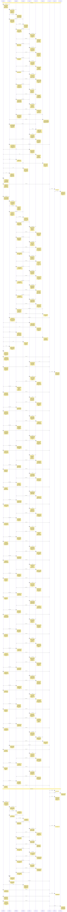

# CHAT_sprint5 — Sprint Archive

## Summary

Sprint 5: Two-Player Battle Mode (Local 1v1 & VS CPU), reciprocal garbage attacks, autonomous CPU AI, and side-by-side dual board viewports across all 4 renderers.

