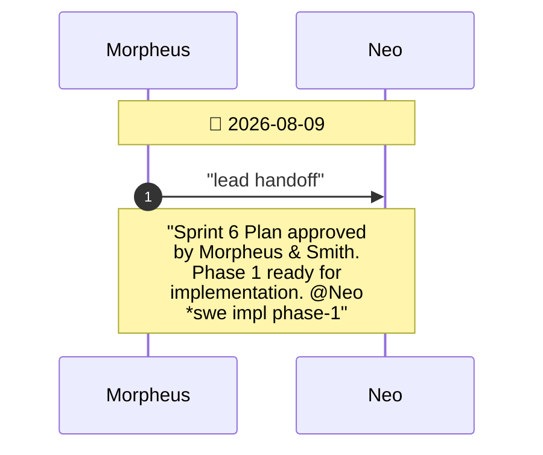

# CHAT_sprint6 — Sprint Archive

## Summary

Sprint 6: WebAssembly (WASM) browser target (wasm32-unknown-unknown), HTML5 canvas container (web/index.html), and local web server automation (make serve).

