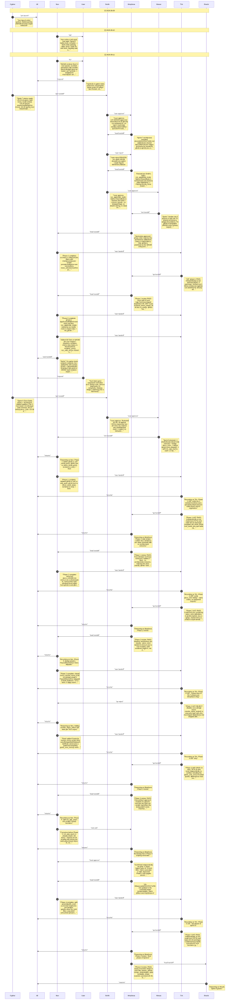

# CHAT_sprint8 — Sprint Archive

## Summary

Sprint 8 (Tech Debt): removed 3 verified-dead functions, deduped piece_color and amain's Paused/GameOver menu dispatch into menu.rs, split amain/abattle_main into update+draw functions in both gfx3d.rs and gfx3d_box.rs. Included a mid-sprint US-39 scope correction (run_app_async was already clean; real target was amain/abattle_main) and one Fix Bloop retry (Trin caught missing tests on new resolve_menu_action logic). 76/76 tests, 0 clippy warnings throughout. Live GUI smoke test still outstanding - flagged for Smith at Stage 3, environment has no display to drive macroquad.

